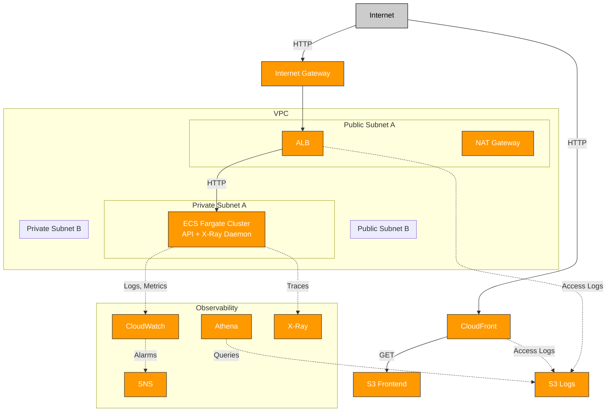

# E-Commerce Platform Architecture

This document describes the AWS infrastructure and CI/CD architecture for the production-grade E-Commerce platform deployed via Terraform and AWS CodePipeline.

## High-Level Overview

- **Frontend**: Static assets hosted on S3, delivered globally via CloudFront.
- **Backend API**: Containerized microservices (product, cart, checkout) running on ECS Fargate, exposed via an Application Load Balancer (ALB).
- **Networking**: VPC with public/private subnets, Internet Gateway, NAT Gateway for secure and scalable networking.
- **Observability**: CloudWatch for metrics/alarms, X-Ray for distributed tracing, Athena for log analysis, SNS for notifications.
- **CI/CD**: Automated pipeline using CodePipeline and CodeBuild for build, test, deploy, and notifications.

## Architecture Diagram

## Key AWS Resources
- **VPC**: Isolated network with public/private subnets, IGW, NAT GW
- **ECS Fargate**: Scalable container orchestration for backend API
- **ALB**: Application Load Balancer for routing and health checks
- **S3**: Static frontend hosting and access logs
- **CloudFront**: CDN for secure, fast global delivery
- **CloudWatch**: Metrics, dashboards, alarms
- **SNS**: Notifications for pipeline and alarms
- **X-Ray**: Distributed tracing for API
- **Athena**: Log analysis and queries

## CI/CD Pipeline
- **Source**: GitHub repository triggers pipeline on push
- **Build**: CodeBuild builds Docker images, runs tests, validates Terraform
- **Deploy**: CodeBuild applies Terraform, updates ECS, syncs S3, invalidates CloudFront
- **Notifications**: SNS alerts on pipeline success/failure

---
For more details, see the module READMEs and pipeline configuration files.