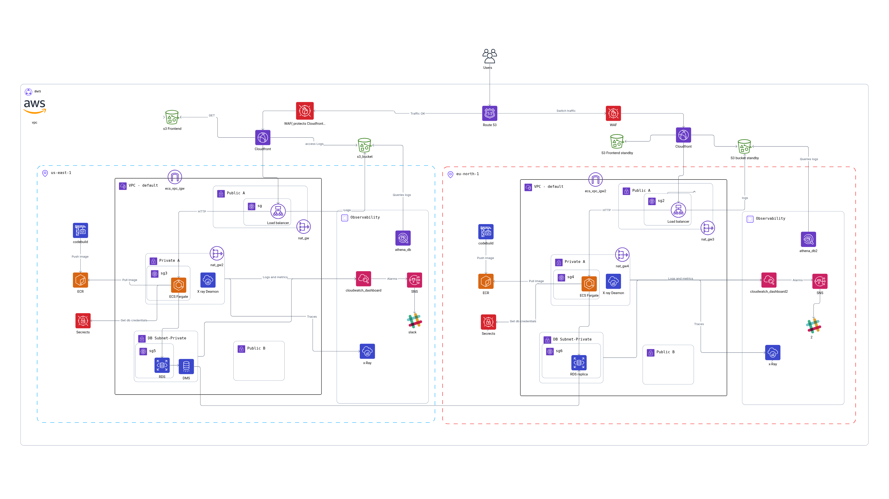
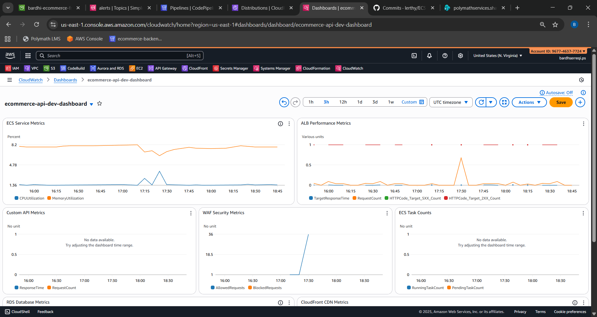
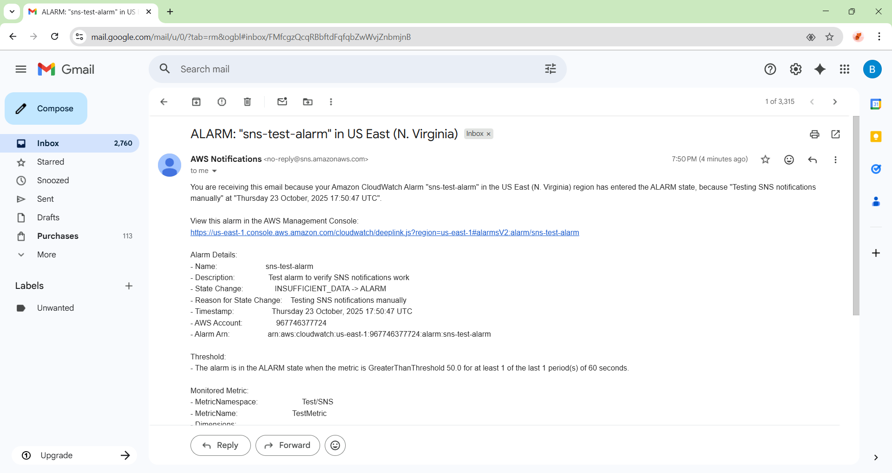

# Final Observability Report

## 1. Architecture Overview

This E-Commerce Observability Platform leverages AWS services and Terraform for scalable, secure, and observable infrastructure. Key components include:

- **Frontend**: S3 static hosting, distributed via CloudFront
- **Backend**: ECS Fargate microservices behind ALB
- **Networking**: VPC with public/private subnets, NAT Gateway, Internet Gateway
- **Observability**: CloudWatch dashboards/alarms, X-Ray tracing, Athena log analysis, SNS notifications
- **CI/CD**: CodePipeline and CodeBuild for automated build, test, deploy

### Architecture Diagram

---

## 2. AWS Well-Architected Framework Pillars

| Pillar                  | AWS Services & Features                                  | Terraform Modules/Files                |
|-------------------------|---------------------------------------------------------|----------------------------------------|
| Operational Excellence  | CloudWatch, SNS, X-Ray, CodePipeline                    | cloudwatch, sns, xray, operational_excellence.tf, CICD/codepipeline.yaml |
| Security                | WAF, IAM, S3/EBS Encryption, CloudTrail, Config, Secrets| waf.tf, security.tf, modules/alb, modules/cloudfront, modules/s3         |
| Reliability             | Multi-AZ ECS/ALB, Route 53, Health Checks, Autoscaling  | vpc, alb, ecs, route53_failover.tf, modules/vpc, modules/alb, modules/ecs|
| Performance Efficiency  | CloudFront, S3, ECS Autoscaling, Athena                 | cloudfront, s3, ecs, athena, performance_efficiency.tf                   |
| Cost Optimization       | S3 Lifecycle, Fargate Spot, Tagging, Right-sizing       | s3, ecs, cost_optimization.tf, variables.tf                              |

---

## 3. Reliability (Warm Standby Summary)

- Multi-AZ deployment for ECS and ALB
- Warm standby architecture with Route 53 failover
- ECS autoscaling and health checks
- Rapid recovery with minimal standby cost

---

## 4. Observability & Alarms

### 4.1 Monitoring Architecture Overview

The project implements a **multi-layered monitoring architecture** across:
- **Infrastructure Layer**: ECS, ALB, RDS, CloudFront
- **Application Layer**: Custom API metrics
- **Security Layer**: WAF metrics
- **Data Layer**: DMS replication monitoring
- **Observability Layer**: X-Ray tracing, Athena analytics

### 4.2 Infrastructure Metrics & Alarms

#### 🚀 ECS (Elastic Container Service) Monitoring

**Primary ECS Alarms:**
- **ECS-CPU-High**: Triggers when CPU > 80% for 2 consecutive 1-minute periods
- **Auto-Scaling Alarms**: AWS managed alarms for CPU/Memory based scaling
  - CPU scale-up: >70%, scale-down: <54%
  - Memory scale-up: >80%, scale-down: <67.5%

**Metrics Collected:**
- CPUUtilization, MemoryUtilization, RunningTaskCount, PendingTaskCount

#### ⚖️ Application Load Balancer (ALB) Monitoring

**ALB Performance Alarms:**
- **ALB Latency**: `ecommerce-alb-dev-latency-dev` (Threshold: 1 second)
- **ALB 5xx Errors**: `ecommerce-alb-dev-5xx-errors-dev` (Threshold: 5 errors)
- **Period**: 60 seconds, 2 evaluation periods

**Metrics Monitored:**
- TargetResponseTime, HTTPCode_Target_5XX_Count, RequestCount, HealthyHostCount

#### 🌍 CloudFront CDN Monitoring

**Cache Performance Alarm:**
- **Cache Hit Ratio**: `cloudfront-cache-hit-ratio-dev` (Minimum: 80%)
- **Purpose**: Ensures optimal CDN performance

**Metrics Tracked:**
- CacheHitRate, Requests, BytesDownloaded, 4xxErrorRate, 5xxErrorRate

#### 🗄️ RDS Database Monitoring

**Database Performance Alarms (Primary & Standby):**
- **CPU High**: 80% threshold, 5-minute periods
- **High Connections**: 80 connections threshold
- **Low Storage**: 1GB free space threshold

**Metrics Monitored:**
- CPUUtilization, DatabaseConnections, FreeStorageSpace, ReadLatency, WriteLatency

### 4.3 Application-Level Metrics & Alarms

#### 📊 Custom API Metrics (ECommerce/API Namespace)

**Application Performance Alarms:**
- **API Response Time**: `api-high-response-time-dev` (Threshold: 2 seconds)
- **API Error Rate**: `api-high-error-rate-dev` (Threshold: 10 errors per 5 minutes)
- **API Request Volume**: `api-low-request-count-dev` (Detects potential outages)

**Custom Metrics Sent:**
- ResponseTime, RequestCount by status code, ErrorCount, BusinessMetrics

### 4.4 Security & Compliance Monitoring

#### 🛡️ WAF (Web Application Firewall) Metrics

**Security Monitoring:**
- **Namespace**: AWS/WAFV2
- **Metrics**: AllowedRequests, BlockedRequests, SampledRequests
- **Coverage**: Both CloudFront and ALB WAF rules

### 4.5 Observability & Tracing

#### 🔍 X-Ray Distributed Tracing
- **Service Map**: Visual service interactions
- **Trace Segments**: Individual request traces
- **Performance Insights**: Response time analysis
- **Error Analysis**: Detailed error tracking

#### 📊 Athena Log Analytics
- **ALB Access Logs**: Query load balancer patterns
- **CloudFront Logs**: Analyze CDN performance
- **Application Logs**: Search application events

### 4.6 Notification & Alerting

#### 📧 SNS Alert Configuration
- **Topic**: `arn:aws:sns:us-east-1:967746377724:alerts`
- **Email**: bardh315@gmail.com (confirmed subscription)
- **Slack**: Configurable via webhook environment variable
- **Alert Types**: ALARM, OK, INSUFFICIENT_DATA states

### 4.7 CloudWatch Dashboards

#### 🎯 Main Observability Dashboard: `ecommerce-observability-dashboard`
**Widgets Include:**
1. **ECS Service Metrics**: CPU/Memory utilization
2. **ALB Performance**: Latency, request count, error rates
3. **RDS Database Metrics**: CPU, connections, storage
4. **CloudFront CDN Metrics**: Requests, cache hit ratio, errors

### 4.8 Auto-Scaling Integration

#### 📈 Dynamic Scaling Based on Metrics
- **ECS CPU-based scaling**: Scale up/down based on CPU utilization
- **ECS Memory-based scaling**: Scale up/down based on memory usage
- **ALB Target tracking**: Automatically adjust ECS tasks based on ALB metrics

### 4.9 Data Retention Policies

#### 📅 Retention Configuration
- **CloudWatch Logs**: 7 days (configurable via log_retention_days)
- **Metrics**: 15 months (AWS default)
- **Alarms History**: 30 days
- **Dashboard Data**: Real-time + historical views

### Evidence Screenshots

#### CloudWatch Dashboard Screenshot

#### SNS Alarm Evidence

---

## 5. CI/CD Implementation Summary

- CodePipeline orchestrates source, build, deploy, and notification stages
- CodeBuild projects for Docker, Terraform, and deployment
- SNS notifications integrated for pipeline events
- All pipeline resources and roles managed via Terraform modules

---

## 6. Evidence Checklist

- [x] Architecture diagram
- [x] CloudWatch Dashboard screenshot
- [x] SNS alarm evidence
- [x] Terraform backend verification
- [x] Athena query results

---

## Implementation Notes

- All Terraform code is formatted with `terraform fmt`
- Backend state managed via S3 and DynamoDB (see scripts/bootstrap_backend.sh)
- ALB access logging and S3 lifecycle rules implemented for cost optimization
- Modular structure maintained for all resources
- See docs/ATHENA_QUERIES.md for sample Athena queries
- Run `terraform validate` and `terraform fmt` in each environment (dev, staging, prod) for best practices

---

> Screenshots and evidence files should be attached or linked as required for final review.
