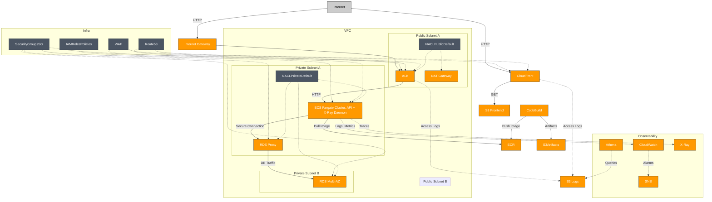

# E-Commerce Platform Architecture

This document describes the AWS infrastructure and CI/CD architecture for the production-grade E-Commerce platform deployed via Terraform and AWS CodePipeline.

## Additional Infrastructure Components

- **Security Groups (SG)**: Act as virtual firewalls for EC2, ECS, ALB, and RDS resources, controlling inbound and outbound traffic at the instance and service level. Each major component (ALB, ECS tasks, RDS, etc.) is protected by its own SG with least-privilege rules.
- **IAM Roles & Policies**: Fine-grained access control for ECS tasks, CodeBuild, Lambda, and other AWS services, ensuring secure operations and least-privilege permissions.
- **Route 53**: Provides DNS management for custom domains and service discovery within the VPC.
- **WAF (Web Application Firewall)**: Protects the ALB and CloudFront distributions from common web exploits and attacks.
- **S3 Buckets for Artifacts**: Used for storing build artifacts, Terraform state, and Athena query results.

## High-Level Overview

- **Frontend**: Static assets hosted on S3, delivered globally via CloudFront.
- **Backend API**: Containerized microservices (product, cart, checkout) running on ECS Fargate, exposed via an Application Load Balancer (ALB).
- **Networking**: VPC with public/private subnets, Internet Gateway, NAT Gateway for secure and scalable networking.
- **Container Registry**: ECR (Elastic Container Registry) for storing and managing Docker images used by ECS and CI/CD.
- **Observability**: CloudWatch for metrics/alarms, X-Ray for distributed tracing, Athena for log analysis, SNS for notifications.
- **CI/CD**: Automated pipeline using CodePipeline and CodeBuild for build, test, deploy, and notifications.

## Architecture Diagram

## Key AWS Resources
- **VPC**: Isolated network with public/private subnets, Internet Gateway (IGW), and NAT Gateway (NAT GW)
- **Security Groups (SG)**: Network-level firewalls for all compute and database resources, enforcing strict traffic rules
- **ECR**: Elastic Container Registry for storing and managing Docker images
- **ECS Fargate**: Scalable container orchestration for backend API
- **ALB**: Application Load Balancer for routing and health checks
- **S3**: Static frontend hosting, access logs, artifact storage, and Athena query results
- **CloudFront**: CDN for secure, fast global delivery
- **CloudWatch**: Metrics, dashboards, alarms
- **SNS**: Notifications for pipeline and alarms
- **X-Ray**: Distributed tracing for API
- **Athena**: Log analysis and queries
- **IAM Roles & Policies**: Secure access management for AWS resources
- **Route 53**: DNS management for custom domains and service discovery
- **WAF**: Web Application Firewall for ALB and CloudFront

## CI/CD Pipeline
- **Source**: GitHub repository triggers pipeline on push
- **Build**: CodeBuild builds Docker images, pushes images to ECR, runs tests, validates Terraform
- **Deploy**: CodeBuild applies Terraform, ECS pulls images from ECR, syncs S3, invalidates CloudFront
- **Notifications**: SNS alerts on pipeline success/failure

---
For more details, see the module READMEs and pipeline configuration files.