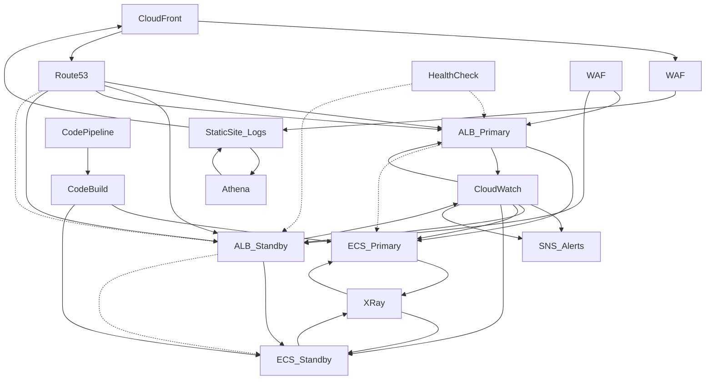

# Reliability Architecture (Mermaid Diagram)

- **IAM:** Fine-grained permissions for cross-region access and failover operations.

## Reliability Strategies

- **Redundancy:** All critical services are deployed in multiple AZs and regions.
- **Automated Failover:** Route53 and ALB health checks trigger failover to healthy endpoints.
- **Backup & Restore:** S3 versioning and cross-region replication ensure data durability.
- **Disaster Recovery:** Infrastructure as Code (Terraform) enables rapid redeployment in new regions.
- **Monitoring & Alerting:** CloudWatch and SNS provide real-time visibility and alerting.
- **Self-Healing:** ECS and ALB automatically replace unhealthy resources.

## Example Region Mapping

- **us-east-1:** Primary region for compute, data, and monitoring.
- **eu-west-1:** Secondary region for disaster recovery and global users.
- **CloudFront:** Uses both regions as origins, with failover.
- **Route53:** Health checks endpoints in both regions, routes traffic accordingly.

## Interactions

- User requests → CloudFront (global edge) → WAF (security) → Route53 (DNS failover) → ALB (multi-AZ, multi-region) → ECS (multi-AZ tasks) → S3 (multi-AZ/region data) → Athena (multi-region queries)
- Monitoring: ECS, ALB, S3, Athena → CloudWatch (metrics/logs) → SNS (alerts) → Operations team
- Tracing: ECS, ALB → X-Ray (distributed tracing)
- Security: All traffic and access controlled by VPC, WAF, IAM

---

# Summary

This architecture leverages AWS managed services, multi-region and multi-AZ deployments, automated failover, and robust monitoring to provide a highly reliable, resilient, and self-healing environment for modern applications. Each component is chosen to minimize downtime, maximize availability, and ensure rapid recovery from failures.