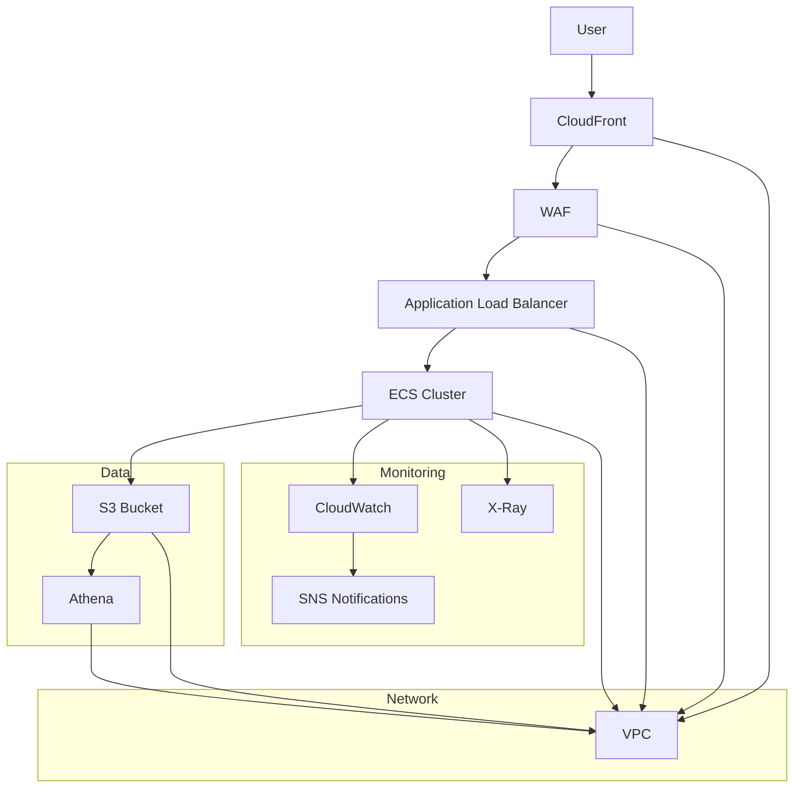

# Reliability Architecture (Mermaid Diagram)

---

# Reliability Architecture Explanation

This architecture is designed to maximize reliability for a cloud-native application using AWS services. Below is an explanation of each component and its role in reliability:

## Components

- **CloudFront (CF):** Distributes content globally, providing redundancy and failover for static and dynamic content.
- **WAF:** Protects against common web exploits and attacks, ensuring application availability.
- **Application Load Balancer (ALB):** Distributes incoming traffic across multiple ECS tasks, enabling high availability and automatic failover.
- **ECS Cluster:** Runs containerized workloads, supports auto-scaling and self-healing for failed tasks.
- **S3 Bucket:** Stores data reliably with built-in redundancy and versioning.
- **Athena:** Provides serverless querying of S3 data, ensuring data accessibility even during compute failures.
- **CloudWatch (CW):** Monitors application health, triggers alarms, and enables automated recovery actions.
- **SNS Notifications:** Sends alerts for failures or critical events, enabling rapid response.
- **X-Ray:** Traces requests and detects bottlenecks or failures in distributed systems.
- **VPC:** Isolates resources, controls network traffic, and supports multi-AZ deployments for resilience.

## Reliability Features

- **Redundancy:** Multi-AZ deployments, load balancing, and distributed storage ensure no single point of failure.
- **Monitoring & Alerting:** CloudWatch and SNS provide real-time monitoring and alerting for failures.
- **Auto-healing:** ECS and ALB automatically replace unhealthy instances and reroute traffic.
- **Security:** WAF and VPC protect against attacks and unauthorized access, reducing risk of downtime.
- **Data Durability:** S3 and Athena ensure data is always available and recoverable.
- **Tracing & Diagnostics:** X-Ray helps quickly identify and resolve reliability issues.

## Summary

This architecture leverages AWS managed services to provide a highly reliable, resilient, and self-healing environment for modern applications. Each component is chosen to minimize downtime, maximize availability, and ensure rapid recovery from failures.